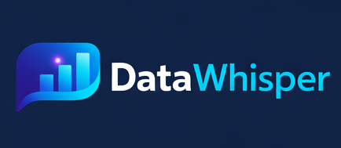
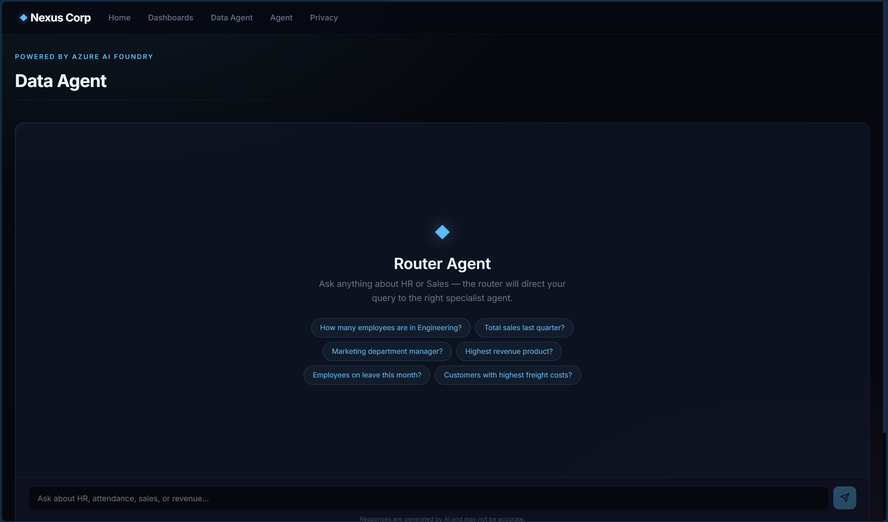
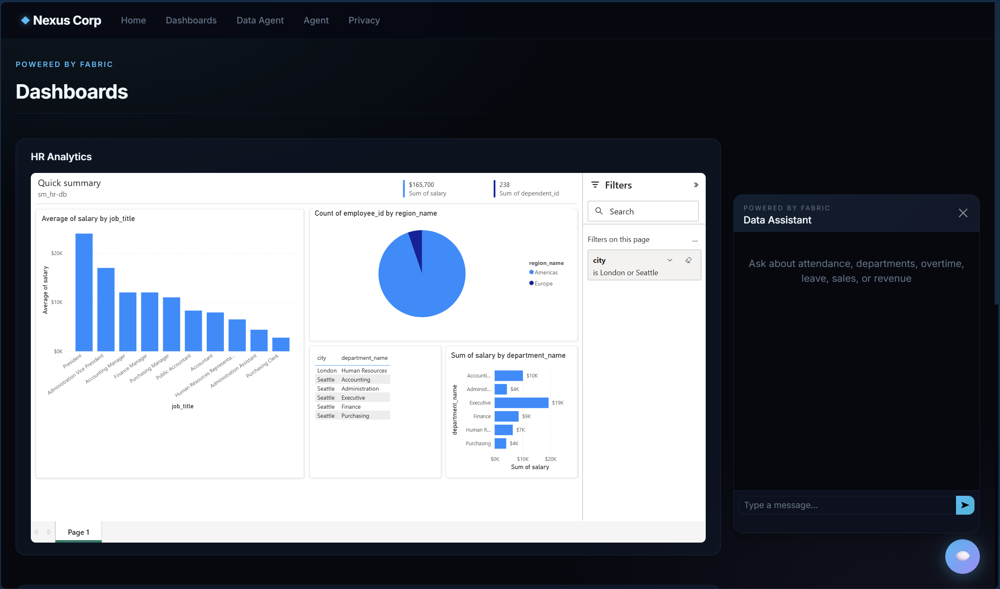
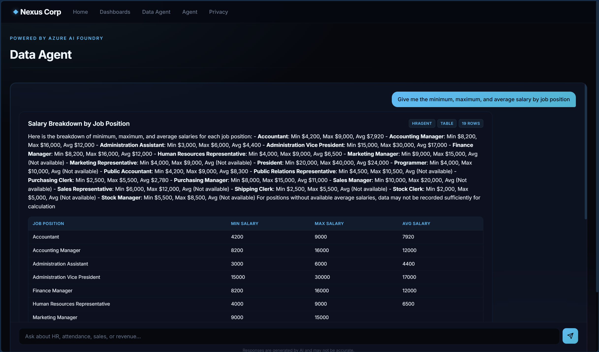
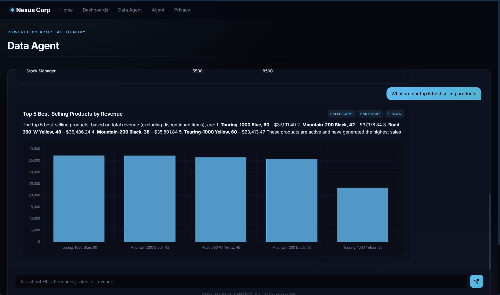
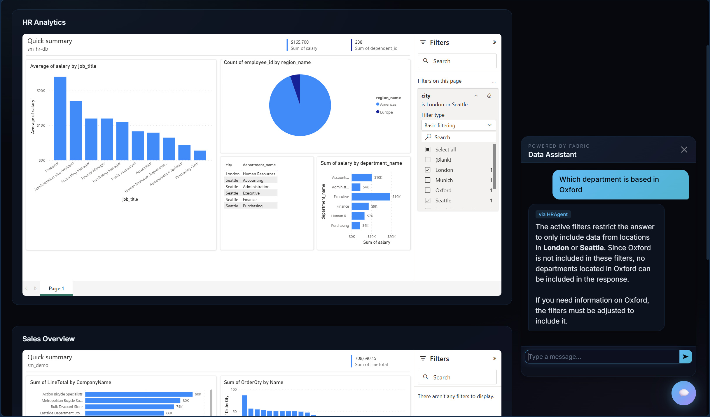
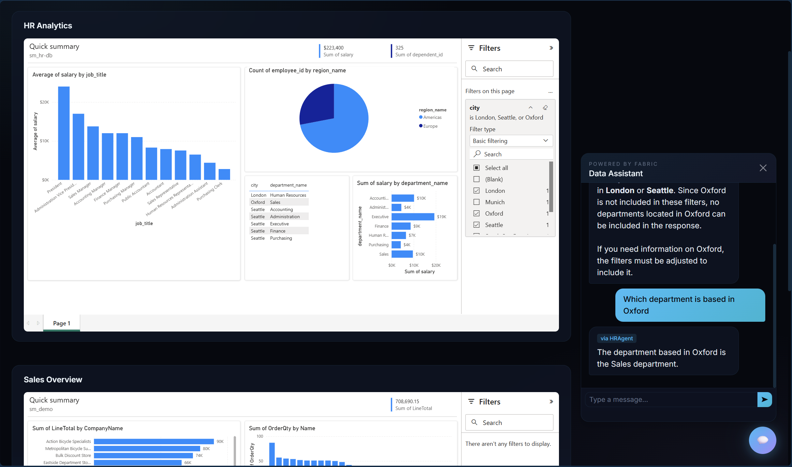

<p align="center">
  
</p>

<p align="center">
  <em>A filter-aware, multi-agent data assistant for Microsoft Fabric — embedded right next to your Power BI reports.</em>
</p>

---

DataWhisper is a .NET portal that pairs **embedded Power BI dashboards** with an **Azure AI Foundry multi-agent assistant**. A `RouterAgent` classifies each question and delegates to the right Fabric Data Agent (`HRAgent`, `SalesAgent`, …), while the chat UI watches your dashboard filters in real time so every answer is scoped to the data you're actually looking at.

---

## ✨ Features

### 🧭 Multi-agent routing with a guided start
A `RouterAgent` reads each question and forwards it to the correct specialist (HR or Sales). Users land on the **Data Agent** page with starter prompts — *"How many employees are in Engineering?"*, *"Total sales last quarter?"* — so they can explore without facing a blank page.



### 📊 Embedded Power BI + side-docked chat
The **Dashboards** page embeds your published Power BI reports using the Power BI JS SDK and "User Owns Data" auth (MSAL.js). A floating **Data Assistant** slides in from the right, so analysts can question the data without ever leaving the report.



### 🧮 Auto-rendered tables & charts
Agent responses are inspected for structured data and rendered as either an interactive table or a Chart.js visualization. Each answer is tagged with the **specialist agent**, the **render type**, and the **row count** so users always know where the result came from.





### 🎯 Filter-aware grounding *(the headline feature)*
Whenever the user changes a slicer, page filter, or report filter, the Power BI JS SDK pushes the new state to `window.activeDashboardFilters`. Every chat call serializes those filters into a natural-language constraint that the specialist agent must respect when generating DAX.

The agent will **refuse to answer outside the active scope** and tell the user how to widen the filter — no silent hallucinations.



Add the missing value to the slicer and ask again — the answer updates instantly:



### 🔐 Enterprise auth out of the box
- Azure AD (Entra ID) user tokens via **MSAL.js** (`acquireTokenPopup` / `acquireTokenSilent`)
- Power BI **"Embed for your organization"** model — RLS still applies
- Backend uses `DefaultAzureCredential` for Foundry agent calls

---

## 🏗️ Architecture

```
┌─────────────────────────────────────────────────────┐
│                .NET Portal (port 5050)              │
│  ┌──────────────────────┐  ┌──────────────────────┐ │
│  │  Embedded Power BI   │  │   Chat UI (popup)    │ │
│  │  Reports (JS SDK)    │  │                      │ │
│  │  ┌────────────────┐  │  │  Sends user question │ │
│  │  │ HR Analytics   │  │  │  + active filters    │ │
│  │  │ Sales Overview │  │  │                      │ │
│  │  └────────────────┘  │  └──────────┬───────────┘ │
│  └──────────────────────┘             │             │
└───────────────────────────────────────┼─────────────┘
                                        │ POST /chat
                                        ▼
                          ┌─────────────────────────┐
                          │  FastAPI Backend (8090)  │
                          │  agent_api.py            │
                          │                          │
                          │  ┌─────────────────────┐ │
                          │  │   RouterAgent        │ │
                          │  │   (classifies query) │ │
                          │  └────────┬────────────┘ │
                          │           │               │
                          │     ┌─────┴──────┐        │
                          │     ▼            ▼        │
                          │  HRAgent    SalesAgent    │
                          │  (Fabric)   (Fabric)      │
                          └─────────────────────────┘
```

## Prerequisites

- [.NET 8 SDK](https://dotnet.microsoft.com/download/dotnet/8.0)
- [Python 3.10+](https://www.python.org/downloads/)
- An [Azure subscription](https://azure.microsoft.com/free/) with:
  - An **Azure AI Foundry** project with RouterAgent, HRAgent, and SalesAgent configured
  - **Microsoft Fabric** workspace with HR and Sales semantic models
  - **Power BI** reports published to the Fabric workspace
- An **Azure AD (Entra ID) App Registration** (see setup below)

## Azure AD App Registration Setup

1. Go to **Azure Portal → Entra ID → App registrations → New registration**
2. Configure:
   - **Name**: `DataWhisper` (or any name)
   - **Supported account types**: Accounts in this organizational directory only
   - **Redirect URI**: Platform = **Single-page application (SPA)**, URI = `http://localhost:5050`
3. After registration:
   - Copy the **Application (client) ID**
   - Go to **API permissions → Add a permission → Power BI Service → Delegated → Report.Read.All** → Grant admin consent
   - Go to **Authentication → Advanced settings → Allow public client flows → Yes**

## Configuration

Update the following placeholder values:

### `Views/Home/Dashboards.cshtml`
```javascript
const CLIENT_ID  = "YOUR_CLIENT_ID_HERE";       // Azure AD App Registration client ID
const TENANT_ID  = "YOUR_TENANT_ID_HERE";       // Azure AD tenant ID
// In the REPORTS array:
reportId: "YOUR_HR_REPORT_ID"                   // Power BI HR report ID
reportId: "YOUR_SALES_REPORT_ID"                // Power BI Sales report ID
```

### `agent_api.py` and `router_agent_test.py`
```python
PROJECT_ENDPOINT = "YOUR_AI_FOUNDRY_PROJECT_ENDPOINT"
```

## Running the Project

### 1. Install Python dependencies

```bash
python -m venv venv
# Windows:
venv\Scripts\activate
# macOS/Linux:
source venv/bin/activate

pip install -r requirements.txt
```

### 2. Start the Agent API

```bash
python -m uvicorn agent_api:app --host 0.0.0.0 --port 8090
```

### 3. Start the .NET Portal

```bash
dotnet run --urls "http://localhost:5050"
```

Or use the convenience script (Windows):
```bash
run-portal.bat
```

### 4. Open the portal

Navigate to [http://localhost:5050](http://localhost:5050) in your browser.

- Go to **Dashboards** to see embedded Power BI reports with the filter-aware chat assistant
- Go to **Data Agent** for the full-page agent chat experience

## How Filter-Aware Chat Works

1. **User applies a filter/slicer** on an embedded Power BI report
2. The report re-renders → the `rendered` event fires
3. The Power BI JS SDK reads all active filters (report-level, page-level, and slicer states)
4. Filters are stored in `window.activeDashboardFilters`
5. When the user sends a chat message, the filters are included in the POST body to `/chat`
6. The backend converts filters into a natural-language constraint and prepends it to the query
7. The specialist agent generates a DAX query that respects the filters and returns a scoped answer

## Project Structure

```
DataWhisper/
├── CompanyPortal.sln          # Solution file
├── CompanyPortal.csproj       # .NET project file
├── Program.cs                 # App entry point
├── agent_api.py               # FastAPI agent backend
├── router_agent_test.py       # Standalone agent routing test
├── requirements.txt           # Python dependencies
├── run-portal.bat             # Windows launch script
├── appsettings.json           # App config
├── appsettings.Development.json
├── Properties/
│   └── launchSettings.json
├── Controllers/
│   └── HomeController.cs
├── Models/
│   └── ErrorViewModel.cs
├── Views/
│   ├── _ViewImports.cshtml
│   ├── _ViewStart.cshtml
│   ├── Home/
│   │   ├── Agent.cshtml       # Full-page agent chat
│   │   ├── Dashboards.cshtml  # Embedded reports + filter-aware chat
│   │   ├── Index.cshtml       # Home page
│   │   └── Privacy.cshtml
│   └── Shared/
│       ├── _Layout.cshtml     # Main layout with navigation
│       └── Error.cshtml
├── wwwroot/
│   ├── css/site.css
│   ├── js/site.js
│   └── lib/
│       ├── powerbi.min.js     # Power BI JS SDK (local)
│       ├── msal-browser.min.js # MSAL.js (local)
│       ├── bootstrap/
│       └── jquery/
└── docs/
    └── img/                    # Logo + feature screenshots used in this README
```

## Embedding Details

- **Embedding model**: "User Owns Data" (Embed for your organization)
- **Token type**: Azure AD (Entra ID) user token via MSAL.js
- **Auth flow**: MSAL.js `acquireTokenPopup` / `acquireTokenSilent`
- **SDK**: Power BI JavaScript SDK (`powerbi-client` v2.23.1)
- Users must have a Power BI Pro/PPU license or reports must be in Premium/Fabric capacity

## Known Limitations

- **Filter enforcement is prompt-based** — filters are passed as LLM instructions, not enforced at the RLS level. For hard enforcement, implement On-Behalf-Of (OBO) token forwarding.
- **Visual-level filters** are not captured — only report-level, page-level, and slicer states are read.
- **Bookmark/drillthrough filters** are not captured by `getFilters()` or `getSlicerState()`.
- **No conversation memory** — each chat message is treated as an independent query.
- **Agent identity** — the backend uses `DefaultAzureCredential`, not the end user's identity, for agent queries.

## License

MIT
